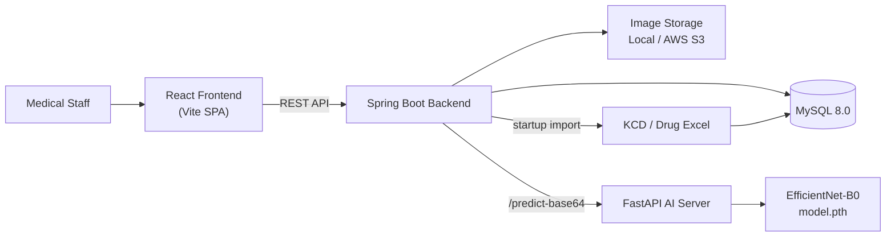
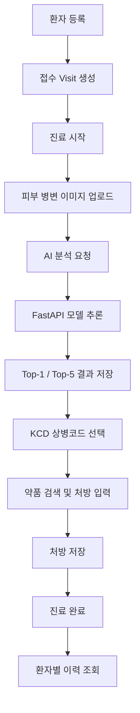
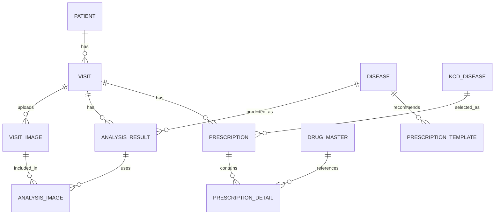

<div align="center">

# 🩺 Artifact Medical AI

**의료 영상 기반 AI 보조 진단 · 처방 지원 시스템**
*AI-assisted Clinical Workflow Prototype for Skin Lesion Diagnosis Support*

<br/>


</div>


> ⚠️ **본 시스템은 의료진의 의사결정을 보조하는 prototype이며, 실제 의료 진단을 대체하지 않습니다.**
> AI는 단일 정답이 아니라 **Top-5 후보 질환**을 제시하고, 최종 진단·상병코드·처방 결정은 항상 의료진이 수행합니다.

---

## 📌 한 줄 소개

피부 병변 이미지를 업로드하면 AI 모델이 **Top-5 후보 질환과 신뢰도(confidence)** 를 제시하고, 의료진이 이를 참고하여 **KCD 상병코드**와 **처방 약품**을 선택해 진료를 완료할 수 있도록 돕는 **진료 워크플로우 지원 시스템**이다.

## 🎯 프로젝트 목적

기존의 피부 병변 AI 서비스 다수는 "AI가 진단명을 알려주는 것"에 초점을 맞추지만, 실제 임상 현장에서는 **접수 → 진료 → 상병 확정 → 처방 → 이력 관리**로 이어지는 워크플로우 전체가 중요하다.

본 프로젝트는 EMR 솔루션 전문 기업 **비트컴퓨터(Bitcomputer)** 와의 산학 협력을 바탕으로, AI 분석 결과를 **진료 워크플로우 안에 자연스럽게 녹여낸** closed-loop clinical assistant를 지향한다. 핵심 설계 원칙은 다음과 같다.

- **AI는 보조 도구다 (AI as assistive, not autonomous).** 단일 정답 대신 Top-K 후보를 제시한다.
- **AI 예측과 의료진 확정 진단은 구조적으로 분리한다.** `analysis_result`(AI 출력)와 `prescription`(의료진 결정)은 별도 테이블로 관리되며, AI 분석 없이도 처방이 가능하다.
- **확장 가능한 인터페이스 설계.** 이미지 저장소(Local / S3)는 인터페이스 추상화로 교체 가능하게 구성했다.

---

## 🖼️ Demo / Screenshots

### 1) 환자 등록 및 접수 생성 — `/`

접수 화면에서 환자 정보를 등록하면 동시에 내원(Visit)이 생성되고, 진료대기/진료완료 현황이 한눈에 표시된다.


### 2) 이미지 업로드 · AI 분석 · 처방 저장 — `/clinic`

접수된 환자를 선택해 진료를 시작하고, 피부 병변 이미지를 업로드한 뒤 AI 분석을 요청한다. 분석 결과를 참고해 상병코드와 처방을 입력하고 진료를 완료한다.


### 3) 환자별 내원 및 처방 이력 조회 — `/lookup`

환자 이름으로 검색하여 내원 기록과 처방 상세 정보를 확인한다.


### 4) 증명서 발급 화면 — `/certificate` *(준비 중 UI)*

진단서 · 소견서 · 진료확인서 · 처방전 발급 UI 목업이 구성되어 있으며, **실제 발급 기능은 추후 구현 예정**이다.


---

## ✨ 핵심 기능

### 🔬 AI 피부 병변 분석 (구현됨)

업로드한 이미지를 EfficientNet-B0 모델로 분석하여 **Top-1 / Top-5 후보 질환**과 confidence, inference time, model version을 반환한다. 신뢰도가 임계값(`MIN_TOP1_CONFIDENCE`) 미만이면 "피부 병변 이미지로 판단하기 어렵습니다…"라는 안내를 반환해 오용을 방지한다.


### 🔎 KCD 상병코드 및 약품 검색 (구현됨)

검색 모달에서 KCD 상병코드와 약품/처방코드를 코드·명칭으로 검색하여 선택한다. 마스터 데이터는 Spring Boot 기동 시 Excel 파일에서 자동 적재된다(**KCD 약 2.4만 건, 약품/처방코드 약 49.6만 건 규모**).


### 📋 진료 워크플로우 (구현됨)

| 영역 | 기능 |
| --- | --- |
| 접수 | 환자 등록(이름·성별·생년월일·연락처·메모), Visit 자동 생성, 진료대기/완료 목록 |
| 진료 | 진료 시작, 이미지 업로드/선택, AI 분석 요청, 상병코드·약품 선택, 처방 저장, 진료 완료 |
| 조회 | 환자 검색, 내원 기록 조회, 처방 상세 조회 |
| 증명서 | 발급 UI 목업 *(실제 발급 예정)* |

---

## 🔄 사용자 워크플로우

1. 접수 화면에서 환자 정보를 등록한다.
2. 환자 등록과 동시에 내원/접수(Visit)가 생성된다.
3. 진료 화면에서 접수된 환자를 선택한다.
4. 진료를 시작하고 피부 병변 이미지를 업로드한다.
5. 업로드한 이미지를 선택해 AI 분석을 요청한다.
6. Spring Boot 백엔드가 이미지를 읽어 FastAPI의 `/predict-base64`를 호출한다.
7. FastAPI가 EfficientNet-B0로 7-class 분류를 수행한다.
8. Top-1 / Top-5 후보 질환과 신뢰도를 반환한다.
9. 의료진이 결과를 참고해 KCD 상병코드를 검색·선택한다.
10. 약품/처방코드를 검색해 처방을 저장한다.
11. 진료를 완료한다.
12. 조회 화면에서 환자별 내원 기록과 처방 정보를 확인한다.
13. 증명서 화면은 현재 UI 목업/예정 기능 상태다.

---

## 🏗️ 시스템 아키텍처




**흐름 요약**: User → React → Spring Boot(REST) → MySQL / Image Storage / FastAPI → 모델 추론 → Spring Boot → React. 백엔드·AI·DB는 Docker Compose로 묶여 동작하며, Frontend는 별도 Vite 개발 서버로 실행한다.

---

## 🔁 데이터 흐름 (DFD / Clinical Workflow)




---

## 🗄️ ERD / DB 설계 요약




**설계 포인트** — `analysis_result`(AI 예측)는 `prescription`(의료진 확정 처방)과 분리되어 있으며, 처방은 AI 분석 결과 없이도 저장할 수 있다(임상적으로 필수적인 분리). `visit_image`와 `analysis_result`는 `analysis_image`를 통해 N:M으로 연결된다.

| 테이블 | 설명 |
| --- | --- |
| `patient` | 환자 기본 정보 |
| `visit` | 내원/접수 단위 |
| `visit_image` | 내원 시 업로드된 이미지 |
| `analysis_result` | AI 분석 결과(Top-K, confidence) |
| `analysis_image` | 분석-이미지 매핑(N:M) |
| `disease` | AI 클래스 매핑용 질환 마스터 |
| `kcd_disease` | KCD 상병코드 마스터 |
| `drug_master` | 약품/처방코드 마스터 |
| `prescription` | 의료진 확정 처방(헤더) |
| `prescription_detail` | 처방 상세(약품 라인) |
| `prescription_template` | 질환별 처방 템플릿 |

---

## 🧰 기술 스택

| 구분 | 기술 |
| --- | --- |
| **Frontend** | React 19, TypeScript, Vite, React Router, Tailwind 계열 유틸리티 스타일 |
| **Backend** | Java 21, Spring Boot 3.5.14, Spring Web, Spring Data JPA, Springdoc OpenAPI, AWS S3 SDK, Apache POI, Lombok |
| **AI Server** | FastAPI, PyTorch, torchvision, timm, EfficientNet-B0, PIL |
| **Database** | MySQL 8.0 |
| **Infra / Dev** | Docker, Docker Compose, Local Image Storage / AWS S3, Git / GitHub |

---

## 📂 폴더 구조

```text
artifact-medical-ai/
├── backend/                 # Spring Boot REST API
├── frontend/                # React + TypeScript frontend
├── fastapi/                 # FastAPI AI inference server
│   ├── main.py
│   ├── model.pth
│   └── notebooks/
├── docker/
│   └── mysql/init/          # MySQL schema init SQL
├── docs/
│   ├── ai-colab-workflow.md
│   └── images/              # README screenshots and diagrams
├── docker-compose.yml
└── README.md
```

---

## ⚙️ 실행 방법

> 실제 포트는 로컬 환경에 따라 달라질 수 있다.

### 1) Docker 기반 백엔드 / AI / DB 실행

```bash
docker compose up --build
```

### 2) Frontend 실행

```bash
cd frontend
npm install
npm run dev
```

### 기본 접속 주소(예시)

| 서비스 | URL |
| --- | --- |
| Frontend | `http://localhost:5173` |
| Backend | `http://localhost:8080` |
| FastAPI | `http://localhost:8000` |
| Swagger / OpenAPI | `http://localhost:8080/swagger-ui/index.html` |

### Docker Compose 서비스 구성

| 서비스 | 내용 |
| --- | --- |
| `mysql` | `mysql:8.0`, port `3306`, database `artifact_db` |
| `fastapi` | build `./fastapi`, port `8000` |
| `backend` | build `./backend`, port `8080`, `depends_on: mysql`, FastAPI URL `http://fastapi:8000` |

---

## 🔐 환경 변수 (`.env` 예시)

```env
DB_PASSWORD=rootpass

AWS_ACCESS_KEY=local-dev-access-key
AWS_SECRET_KEY=local-dev-secret-key
AWS_S3_BUCKET=local-dev-bucket
AWS_REGION=us-east-1

IMAGE_STORAGE_TYPE=local
IMAGE_LOCAL_UPLOAD_DIR=/tmp/artifact-images

FASTAPI_URL=http://localhost:8000
MIN_TOP1_CONFIDENCE=0.45
```

- 로컬 개발에서는 `IMAGE_STORAGE_TYPE=local`로 설정하면 **실제 AWS 없이** 이미지 업로드/분석 흐름을 검증할 수 있다.
- 운영 또는 실제 S3 연동 시 AWS 키와 bucket을 설정한다.
- `MIN_TOP1_CONFIDENCE`는 AI 모델이 유효 이미지로 판단하는 **최소 Top-1 신뢰도 기준**이다.

---

## 🌐 API 요약

| Domain | Method | Endpoint | Description |
| --- | --- | --- | --- |
| Patient | POST | `/api/v1/patients` | 환자 등록 |
| Patient | GET | `/api/v1/patients/{id}` | 환자 단건 조회 |
| Patient | GET | `/api/v1/patients?name=` | 환자 이름 검색 |
| Visit | POST | `/api/v1/visits` | 접수 생성 |
| Visit | GET | `/api/v1/visits` | 내원/접수 목록 조회 |
| Visit | GET | `/api/v1/visits/{id}` | 내원 단건 조회 |
| Visit | PATCH | `/api/v1/visits/{id}/start` | 진료 시작 |
| Visit | PATCH | `/api/v1/visits/{id}/diagnose` | 진단/상병 확정 |
| Visit | PATCH | `/api/v1/visits/{id}/complete` | 진료 완료 |
| Image | POST | `/api/v1/visits/{visitId}/images` | 이미지 업로드 |
| Image | GET | `/api/v1/visits/{visitId}/images` | 이미지 목록 조회 |
| Analysis | POST | `/api/v1/visits/{visitId}/analysis` | 이미지 기반 AI 분석 요청 |
| Analysis | GET | `/api/v1/visits/{visitId}/analysis` | 분석 결과 조회 |
| Master | GET | `/api/v1/kcd-diseases?query=` | KCD 상병코드 검색 |
| Master | GET | `/api/v1/drugs?query=` | 약품/처방코드 검색 |
| Prescription | POST | `/api/v1/visits/{visitId}/prescription` | 최종 처방 저장 |
| Prescription | GET | `/api/v1/visits/{visitId}/prescription` | 처방 조회 |

> 전체 스펙은 Swagger UI(`/swagger-ui/index.html`)에서 확인할 수 있다.

---

## 🤖 AI 모델 설명

| 항목 | 내용 |
| --- | --- |
| **모델** | EfficientNet-B0 (timm) |
| **목적** | 피부 병변 이미지 7-class 분류 |
| **입력 전처리** | Resize 224×224, Normalize (ImageNet mean/std) |
| **출력** | Top-1 질환, Top-5 후보 질환, confidence |
| **모델 파일** | `fastapi/model.pth` |
| **학습 노트북** | `fastapi/notebooks/skin_lesion_training_colab.ipynb` |
| **참고 문서** | `docs/ai-colab-workflow.md` |

### 지원 질환 클래스 (7-class)

| 코드 | 한글명 | 영문 |
| --- | --- | --- |
| `akiec` | 광선각화증 / 상피내암 | Actinic keratoses / intraepithelial carcinoma |
| `bcc` | 기저세포암 | Basal cell carcinoma |
| `bkl` | 양성 각화증성 병변 | Benign keratosis-like lesions |
| `df` | 피부섬유종 | Dermatofibroma |
| `mel` | 악성 흑색종 | Melanoma |
| `nv` | 멜라닌세포모반 | Melanocytic nevi |
| `vasc` | 혈관성 병변 | Vascular lesions |

### FastAPI 엔드포인트

| Method | Endpoint | 설명 |
| --- | --- | --- |
| GET | `/health` | 헬스 체크 |
| POST | `/predict` | 이미지 파일 기반 추론 |
| POST | `/predict-base64` | base64 이미지 기반 추론(백엔드 연동용) |

> **주의**: 본 시스템은 의료진의 의사결정을 보조하는 prototype이며, 실제 의료 진단을 대체하지 않는다. `MIN_TOP1_CONFIDENCE` 미만의 입력은 유효 이미지로 간주하지 않는다.

---

## 🛠️ 트러블슈팅

| 증상 | 점검 사항 |
| --- | --- |
| MySQL 기동 실패 | 포트 `3306` 충돌 여부 확인(기존 MySQL 종료 또는 포트 매핑 변경) |
| 코드 변경이 반영되지 않음 | `docker compose up --build`로 컨테이너 재빌드 |
| FastAPI 시작 실패 | `fastapi/model.pth` 누락 여부 확인 |
| 검색 결과가 비어 있음 | `kcd_disease.xlsx` / `drug_master.xlsx` 적재 여부 확인 |
| S3 관련 오류 | 환경변수 미설정 시 `IMAGE_STORAGE_TYPE=local` 권장 |
| Frontend API 호출 실패 | 동일 origin / proxy 설정 확인 |
| AI가 "유효하지 않은 이미지"로 실패 | `MIN_TOP1_CONFIDENCE` 값과 입력 이미지 품질 확인 |

---

## 🚀 향후 개선 계획

> 아래는 **예정 기능**이며, 위 "핵심 기능"의 구현 항목과 구분된다.

- 증명서 / 진단서 **실제 발급 기능** 구현
- 처방 상세 **다중 약품 입력 UX** 개선
- AI 모델 **성능 평가 지표(metric)** 추가
- 모델 **학습 / 배포 파이프라인 자동화**
- **사용자 인증 / 권한 관리**, 의료진·관리자 계정 분리
- 실제 **EMR 연동 가능성** 검토 (비트컴퓨터 산학 연계)
- **테스트 코드 및 CI/CD** 보강
- 분석 결과 **explainability (Grad-CAM 등 시각화)** 도입

---

## 🌿 팀 협업 / 브랜치 전략

| 브랜치 | 용도 |
| --- | --- |
| `main` | 발표/배포 가능한 안정 버전 |
| `dev` | 통합 개발 브랜치 |
| `[name]/[feature]`, `feature/*`, `fix/*`, `docs/*` | 개인/기능 브랜치 |

- 모든 변경은 **PR 기반 병합**을 원칙으로 한다.
- 릴리즈 태그 예시: `v0.1.0`

---

## 📄 참고 사항

- 본 프로젝트는 **동국대학교 종합설계(캡스톤디자인)** 과정에서 EMR 솔루션 전문 기업 **비트컴퓨터(Bitcomputer)** 와의 산학 협력으로 진행되었다.
- 사용된 KCD 상병코드 및 약품/처방코드 마스터 데이터는 학습/연구 목적의 데모용으로 적재되며, 라이선스 및 사용 범위는 원 데이터 제공처의 정책을 따른다.
- HAM10000 등 공개 데이터셋은 각 데이터셋의 라이선스 및 DUA(Data Use Agreement)를 준수한다.
