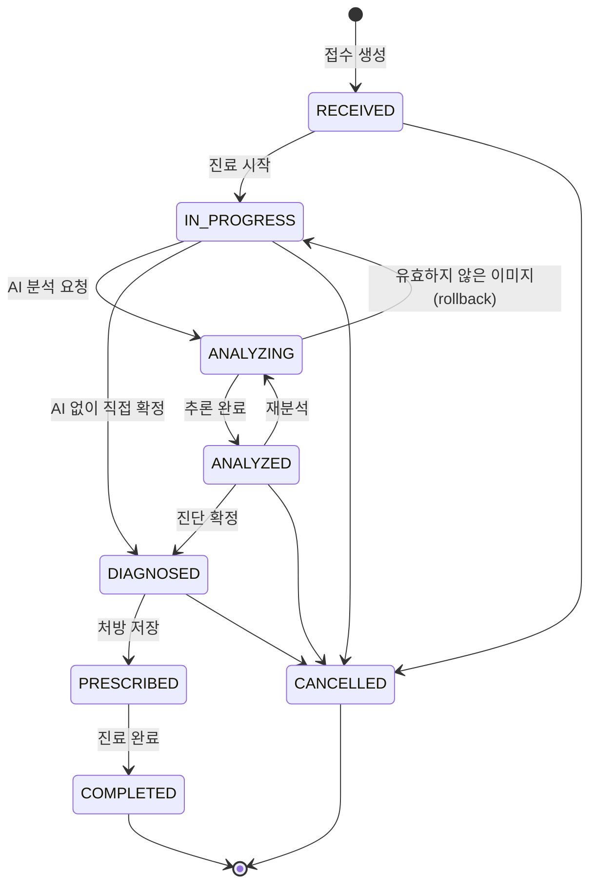
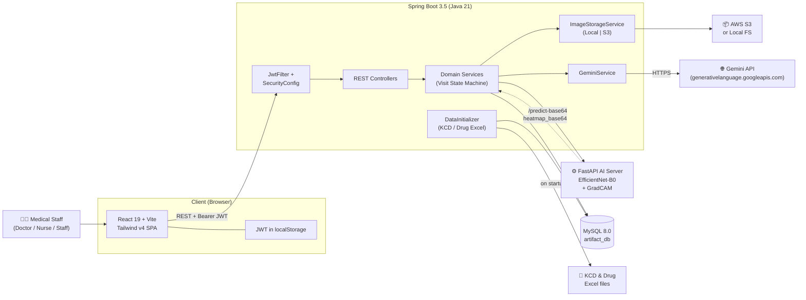
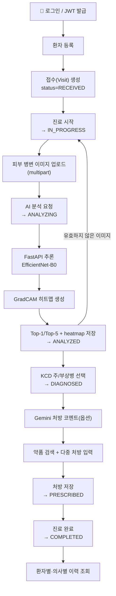
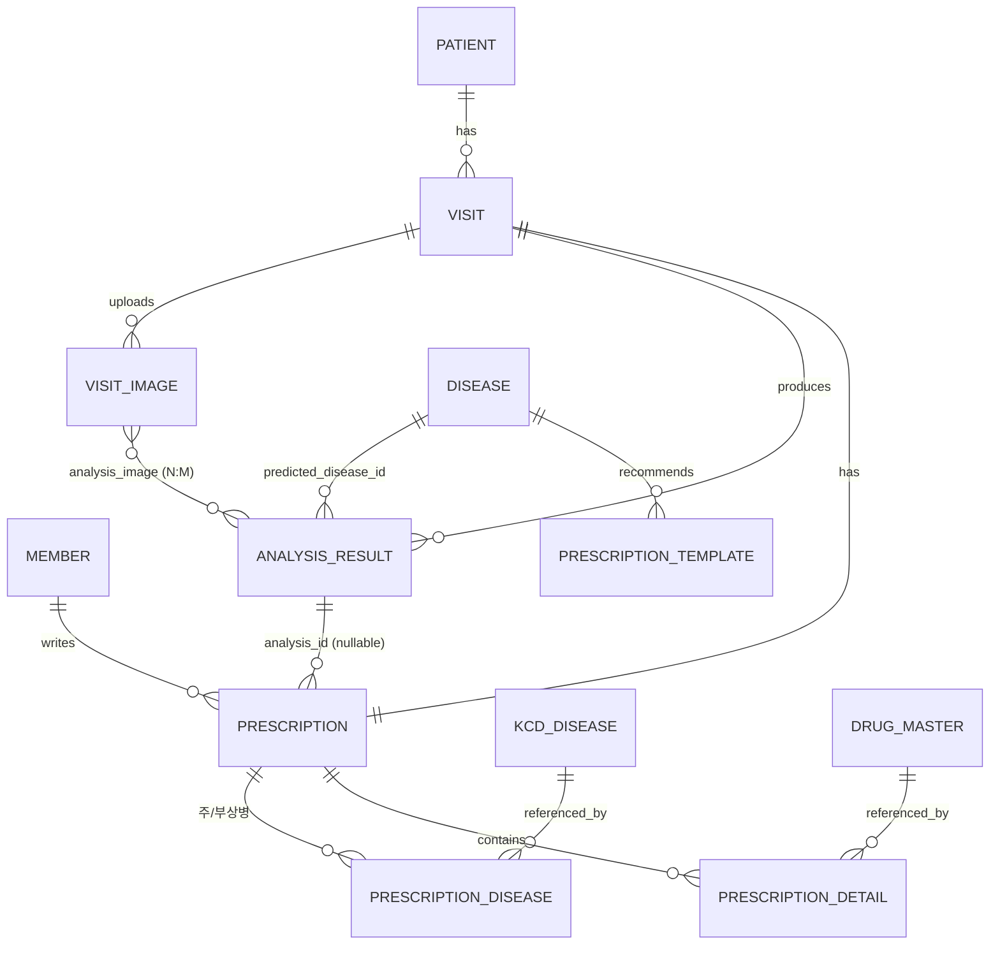

<div align="center">

# 🩺 Artifact Medical AI

**의료 영상 기반 AI 보조 진단 · 처방 지원 시스템**
*AI-assisted Clinical Workflow Prototype for Skin Lesion Diagnosis Support*

<br/>


</div>


> ⚠️ **본 시스템은 의료진의 의사결정을 보조하는 prototype이며, 실제 의료 진단을 대체하지 않습니다.**
> AI는 단일 정답이 아니라 **Top-5 후보 질환**을 제시하고, 최종 진단·상병코드·처방 결정은 항상 의료진이 수행합니다.

---

## 📌 한 줄 소개

피부 병변 이미지를 업로드하면 AI 모델이 **Top-5 후보 질환 + 신뢰도(confidence) + GradCAM 설명 히트맵**을 제시하고, 의료진이 이를 참고해 **KCD 상병코드(주/부상병)** 와 **처방 약품**을 선택해 진료를 완료할 수 있도록 돕는 **진료 워크플로우 지원 시스템**이다. 처방 작성 단계에서는 **Gemini LLM이 처방 코멘트 2줄을 생성**해 의료진의 작성을 보조한다.

## 🎯 프로젝트 목적

기존의 피부 병변 AI 서비스 다수는 "AI가 진단명을 알려주는 것"에 초점을 맞추지만, 실제 임상 현장에서는 **로그인 → 접수 → 진료 → AI 분석 → 진단 확정 → 처방 → 완료 → 이력 관리**로 이어지는 워크플로우 전체가 중요하다.

본 프로젝트는 EMR 솔루션 전문 기업 **비트컴퓨터(Bitcomputer)** 와의 산학 협력을 바탕으로, AI 분석 결과를 **진료 워크플로우 안에 자연스럽게 녹여낸** closed-loop clinical assistant를 지향한다. 핵심 설계 원칙은 다음과 같다.

- **AI는 보조 도구다 (AI as assistive, not autonomous).** 단일 정답 대신 Top-K 후보 + 설명 히트맵을 제시한다.
- **AI 예측과 의료진 확정 진단은 구조적으로 분리한다.** `analysis_result`(AI 출력)와 `prescription`(의료진 결정)은 별도 테이블이며, AI 분석 없이도 처방을 작성할 수 있다(`analysis_id` nullable).
- **진료 상태는 8단계 상태머신으로 엄격히 관리한다.** 잘못된 순서의 호출은 도메인 단에서 `IllegalStateException`으로 거부된다.
- **모든 처방은 작성자(의료진)에 귀속된다.** 처방 시점의 `member_id` + `member_name` 스냅샷을 함께 저장한다.
- **확장 가능한 인터페이스 설계.** 이미지 저장소(`ImageStorageService`)는 Local / S3 구현을 인터페이스로 추상화했다.

---

## 🖼️ Demo / Screenshots

### 0) 로그인 / 회원가입 — `/`

직책(의사/간호사/일반)을 선택해 회원가입하거나 기존 계정으로 로그인한다. 인증 후 JWT 토큰이 `localStorage`에 저장되고 보호된 라우트(`/main/*`)로 진입할 수 있다. 초기 테스트 계정은 `admin / 1234` 이다.

<!-- ┌─────────────────────────────────────────────────────────────┐ -->
<!-- │ 🖼️  IMAGE: 로그인/회원가입 화면                                │ -->
<!-- │ 경로 : docs/images/screenshot-login.png                       │ -->
<!-- │ 화면 : 로그인/회원가입 탭 토글, 직책 선택 dropdown 보이게      │ -->
<!-- └─────────────────────────────────────────────────────────────┘ -->


### 1) 환자 등록 및 접수 생성 — `/main`

접수 화면에서 환자 정보를 등록하면 동시에 내원(Visit)이 생성되고, 진료대기/진료완료 현황이 한눈에 표시된다.

<!-- ┌─────────────────────────────────────────────────────────────┐ -->
<!-- │ 🖼️  IMAGE: 접수 화면                                          │ -->
<!-- │ 경로 : docs/images/screenshot-reception.png                   │ -->
<!-- │ 화면 : 환자정보 입력 폼 + 진료 현황 테이블 + 최근 접수         │ -->
<!-- └─────────────────────────────────────────────────────────────┘ -->


### 2) 진료 · AI 분석 · 처방 — `/main/clinic`

접수된 환자를 선택해 진료를 시작하고, 피부 병변 이미지를 업로드한 뒤 AI 분석을 요청한다. Top-5 후보와 **GradCAM 히트맵**이 함께 표시되며, 의료진은 결과를 참고해 KCD 상병(주/부상병)과 약품 처방을 입력한다. 처방 작성 직전 **Gemini AI 처방 코멘트(2줄)** 를 생성해 작성을 보조한다.

<!-- ┌─────────────────────────────────────────────────────────────┐ -->
<!-- │ 🖼️  IMAGE: 진료 메인 화면                                      │ -->
<!-- │ 경로 : docs/images/screenshot-clinic.png                      │ -->
<!-- │ 화면 : 환자 정보 + 이미지 업로드/선택 + AI 분석 결과 + 처방   │ -->
<!-- └─────────────────────────────────────────────────────────────┘ -->


### 3) AI 분석 결과 + GradCAM 설명 히트맵

Top-1 질환명, Top-5 후보, confidence, inference time, model version과 함께 **GradCAM 오버레이 이미지**가 반환된다. 신뢰도가 임계값(`MIN_TOP1_CONFIDENCE`) 미만이면 "피부 병변 이미지로 판단하기 어렵습니다…" 안내를 반환해 오용을 방지한다.

<!-- ┌─────────────────────────────────────────────────────────────┐ -->
<!-- │ 🖼️  IMAGE: AI 분석 결과 카드 + 히트맵                         │ -->
<!-- │ 경로 : docs/images/screenshot-ai-analysis.png                 │ -->
<!-- │ 화면 : Top-1 / Top-5 리스트 + confidence + 히트맵 오버레이    │ -->
<!-- └─────────────────────────────────────────────────────────────┘ -->


### 4) Gemini AI 처방 코멘트

주상병/부상병/접수 메모를 바탕으로 LLM이 **추천 처방 방향 1줄 + 환자 주의사항 1줄**, 정확히 2줄의 코멘트를 생성해 처방 카드에 노출한다. API 키 미설정·503 과부하 시에도 사용자 친화적 메시지를 반환한다.

<!-- ┌─────────────────────────────────────────────────────────────┐ -->
<!-- │ 🖼️  IMAGE: Gemini AI 코멘트 영역                              │ -->
<!-- │ 경로 : docs/images/screenshot-ai-comment.png                  │ -->
<!-- │ 화면 : 처방 카드 안 2줄 코멘트 (약품명+코드 / 주의사항)        │ -->
<!-- └─────────────────────────────────────────────────────────────┘ -->


### 5) KCD / 약품 검색 모달

검색 모달에서 KCD 상병코드와 약품/처방코드를 **코드 또는 한글명**으로 검색하여 선택한다. 마스터 데이터는 Spring Boot 기동 시 Excel 파일에서 자동 적재된다 (**KCD 약 2.4만 건, 약품/처방코드 약 49.6만 건 규모**).

<!-- ┌─────────────────────────────────────────────────────────────┐ -->
<!-- │ 🖼️  IMAGE: 검색 모달                                          │ -->
<!-- │ 경로 : docs/images/screenshot-search-modal.png                │ -->
<!-- │ 화면 : KCD/약품 검색 모달, 코드+명칭+선택 버튼                 │ -->
<!-- └─────────────────────────────────────────────────────────────┘ -->


### 6) 환자 / 내원 이력 조회 — `/main/lookup`

차트번호, 이름, 내원일 조건을 조합해 환자를 검색한다. 환자별 내원 기록과 처방 상세를 확인한다.

<!-- ┌─────────────────────────────────────────────────────────────┐ -->
<!-- │ 🖼️  IMAGE: 조회 화면                                          │ -->
<!-- │ 경로 : docs/images/screenshot-lookup.png                      │ -->
<!-- │ 화면 : 환자 검색 결과 + 내원 기록 + 처방 상세                  │ -->
<!-- └─────────────────────────────────────────────────────────────┘ -->


### 7) 증명서 발급 화면 — `/main/certificate` *(준비 중 UI)*

진단서 · 소견서 · 진료확인서 · 처방전 발급 UI 목업이 구성되어 있으며, **실제 발급 기능은 추후 구현 예정**이다.

<!-- ┌─────────────────────────────────────────────────────────────┐ -->
<!-- │ 🖼️  IMAGE: 증명서 화면                                        │ -->
<!-- │ 경로 : docs/images/screenshot-certificate.png                 │ -->
<!-- │ 화면 : 발급 UI 목업 (준비중 안내가 보이게)                     │ -->
<!-- └─────────────────────────────────────────────────────────────┘ -->


---

## ✨ 핵심 기능

### 🔐 JWT 기반 인증 · 역할 관리 (구현됨, 신규)

- BCrypt로 해시된 비밀번호로 회원가입/로그인하고, 발급된 JWT를 모든 API 호출에 `Authorization: Bearer …` 헤더로 첨부한다.
- 역할(`MemberRole`): `DOCTOR`, `NURSE`, `STAFF`, `ADMIN`
- Spring Security + 커스텀 `JwtFilter`로 stateless 인증을 구성한다.
- 기본 테스트 계정: `admin / 1234`

### 🔬 AI 피부 병변 분석 + GradCAM 설명 히트맵 (구현됨, 신규)

업로드 이미지를 EfficientNet-B0 모델로 분석하여 **Top-1 / Top-5 후보 질환 + confidence + inference time + model version** 을 반환한다. 동시에 **GradCAM 오버레이 이미지(JPEG)** 를 함께 생성·저장해 의료진이 "AI가 어디를 보고 판단했는지"를 시각적으로 확인할 수 있다. GradCAM은 cv2/grad-cam 라이브러리 의존 없이 **순수 PyTorch + Pillow** 로 구현되어 컨테이너 이미지가 가볍다.

### 💬 Gemini LLM 처방 코멘트 (구현됨, 신규)

처방 작성 직전 `POST /api/v1/visits/{visitId}/prescription/comment` 호출 시, 백엔드가 **주상병/부상병/접수 메모**와 **DB의 피부 치료 약품 풀(연고·크림 10개)** 을 프롬프트로 조합해 Gemini API에 요청한다. 응답은 **정확히 2줄** 로 파싱된다(약품명+코드 포함 처방 방향, 환자 주의사항). 503 과부하에 대해서는 1초·2초 간격으로 최대 3회 자동 재시도한다.

### 🧭 8-state Visit State Machine (구현됨)

진료 진행은 도메인 엔티티(`Visit`)에 캡슐화된 상태머신으로 관리된다. 잘못된 순서의 호출은 `IllegalStateException`으로 거부된다.

```
RECEIVED ─▶ IN_PROGRESS ─▶ ANALYZING ─▶ ANALYZED ─▶ DIAGNOSED ─▶ PRESCRIBED ─▶ COMPLETED
                                ▲           │
                                └─rollback──┘  (잘못된 이미지 → IN_PROGRESS 복구)

            (어느 단계에서도 CANCELLED 가능)
```


```mermaid
stateDiagram-v2
    [*] --> RECEIVED : 접수 생성
    RECEIVED --> IN_PROGRESS : 진료 시작
    IN_PROGRESS --> ANALYZING : AI 분석 요청
    ANALYZING --> ANALYZED : 추론 완료
    ANALYZING --> IN_PROGRESS : 유효하지 않은 이미지(rollback)
    ANALYZED --> ANALYZING : 재분석
    ANALYZED --> DIAGNOSED : 진단 확정
    IN_PROGRESS --> DIAGNOSED : AI 없이 직접 확정
    DIAGNOSED --> PRESCRIBED : 처방 저장
    PRESCRIBED --> COMPLETED : 진료 완료
    RECEIVED --> CANCELLED
    IN_PROGRESS --> CANCELLED
    ANALYZED --> CANCELLED
    DIAGNOSED --> CANCELLED
    COMPLETED --> [*]
    CANCELLED --> [*]
```

### 📋 진료 워크플로우 (구현됨)

| 영역 | 기능 |
| --- | --- |
| 인증 | 회원가입(직책 선택), 로그인, JWT 발급, 보호된 라우트 |
| 접수 | 환자 등록(이름·성별·생년월일·연락처·메모), Visit 자동 생성, 진료대기/완료 목록 |
| 진료 | 진료 시작, 이미지 업로드/선택, AI 분석 + GradCAM, **주/부상병 다중 등록**, 약품 다중 처방, Gemini 코멘트, 처방 저장, 진료 완료 |
| 조회 | **차트번호/이름/내원일 조합 검색**, 환자별 내원 기록, 처방 상세 |
| 의사별 조회 | `doctorId + from~to` 기간으로 의사별 환자 처방 이력 조회 |
| 증명서 | 발급 UI 목업 *(실제 발급 예정)* |

### 🔎 KCD 상병코드 / 약품코드 검색 (구현됨)

- KCD 상병코드: **약 50,941행 / 고유 24,328건** (`상병코드`, `상병명`, `상병명 영문`)
- 처방(약품) 코드: **약 505,968행 / 고유 496,148건** (`처방코드`, `처방명`, `처방명 영문`)
- 검색은 코드 contains + 한글명 contains로 페이징하여 반환된다.

---

## 🔄 사용자 워크플로우

1. **로그인** 화면에서 직책을 선택해 회원가입하거나 로그인한다.
2. **접수** 화면에서 환자 정보를 등록한다 → 동시에 Visit(`RECEIVED`)이 생성된다.
3. **진료** 화면에서 접수된 환자를 선택한다.
4. 진료를 시작한다(`RECEIVED → IN_PROGRESS`).
5. 피부 병변 이미지를 업로드한다.
6. 업로드한 이미지를 선택해 AI 분석을 요청한다(`IN_PROGRESS → ANALYZING`).
7. Spring Boot 백엔드가 이미지를 base64로 인코딩해 FastAPI `/predict-base64` 를 호출한다.
8. FastAPI가 EfficientNet-B0로 7-class 분류 + GradCAM 히트맵을 생성한다.
9. Top-1 / Top-5 후보 + GradCAM 오버레이가 저장된다(`ANALYZING → ANALYZED`).
10. 의료진이 결과를 참고해 KCD **주상병**(필수) + **부상병**(선택)을 검색·확정한다(`ANALYZED → DIAGNOSED`).
11. 약품/처방코드를 검색해 다중 약품 처방(용법·기간·주의사항)을 입력한다.
12. (옵션) **Gemini AI 처방 코멘트** 를 생성해 작성을 보조받는다.
13. 처방을 저장한다(`DIAGNOSED → PRESCRIBED`).
14. 진료를 완료한다(`PRESCRIBED → COMPLETED`).
15. 조회 화면에서 환자별 내원·처방 이력을 확인한다.
16. (예정) 증명서 화면에서 진단서/처방전을 발급한다.

---

## 🏗️ 시스템 아키텍처

<!-- ┌─────────────────────────────────────────────────────────────┐ -->
<!-- │ 🖼️  IMAGE: 시스템 아키텍처 다이어그램                          │ -->
<!-- │ 경로 : docs/images/architecture.png                           │ -->
<!-- │ 도구 : Mermaid → PNG export 추천                              │ -->
<!-- └─────────────────────────────────────────────────────────────┘ -->



```mermaid
flowchart LR
    U["👨‍⚕️ Medical Staff<br/>(Doctor / Nurse / Staff)"]
    subgraph CLIENT["Client (Browser)"]
        FE["React 19 + Vite<br/>Tailwind v4 SPA"]
        TOK["JWT in localStorage"]
        FE --- TOK
    end
    subgraph BACKEND["Spring Boot 3.5 (Java 21)"]
        SEC["JwtFilter +<br/>SecurityConfig"]
        API["REST Controllers"]
        SVC["Domain Services<br/>(Visit State Machine)"]
        IMG["ImageStorageService<br/>(Local | S3)"]
        GEM["GeminiService"]
        DI["DataInitializer<br/>(KCD / Drug Excel)"]
    end
    AI["⚙️ FastAPI AI Server<br/>EfficientNet-B0<br/>+ GradCAM"]
    DB[("MySQL 8.0<br/>artifact_db")]
    S3["📦 AWS S3<br/>or Local FS"]
    GAPI["🌐 Gemini API<br/>(generativelanguage.googleapis.com)"]
    DATA["📑 KCD & Drug<br/>Excel files"]

    U --> FE
    FE -->|"REST + Bearer JWT"| SEC
    SEC --> API
    API --> SVC
    SVC --> IMG
    SVC --> GEM
    SVC --> DB
    IMG --> S3
    SVC -->|"/predict-base64"| AI
    GEM -->|"HTTPS"| GAPI
    DI -->|"on startup"| DATA
    DI --> DB
    AI -.->|"heatmap_base64"| SVC
```

**핵심 흐름**

- 모든 비-인증 API는 `JwtFilter`를 통과한 뒤에야 컨트롤러에 도달한다. `/auth/login`, `/auth/signup`, `/swagger-ui/**`, 이미지/히트맵 컨텐츠 엔드포인트는 화이트리스트로 공개된다.
- 이미지 업로드는 `ImageStorageService` 인터페이스(Local / S3 구현 전환 가능)를 통과한다. 도커 기본은 `local`, 운영은 `s3`.
- AI 분석은 백엔드 → FastAPI base64 호출로 일원화되어 있어 모델 서버를 GPU 인스턴스로 옮기기 쉽다.
- Gemini 호출은 백엔드에서만 발생한다 — 프론트는 API 키를 알지 못한다.

---

## 🔁 데이터 흐름 (DFD / Clinical Workflow)

<!-- ┌─────────────────────────────────────────────────────────────┐ -->
<!-- │ 🖼️  IMAGE: Clinical Workflow DFD                              │ -->
<!-- │ 경로 : docs/images/clinical-workflow-dfd.png                  │ -->
<!-- │ 도구 : Mermaid → PNG export 추천                              │ -->
<!-- └─────────────────────────────────────────────────────────────┘ -->



```mermaid
flowchart TD
    L["🔐 로그인 / JWT 발급"] --> A["환자 등록"]
    A --> B["접수(Visit) 생성<br/>status=RECEIVED"]
    B --> C["진료 시작<br/>→ IN_PROGRESS"]
    C --> D["피부 병변 이미지 업로드<br/>(multipart)"]
    D --> E["AI 분석 요청<br/>→ ANALYZING"]
    E --> F["FastAPI 추론<br/>EfficientNet-B0"]
    F --> G["GradCAM 히트맵 생성"]
    G --> H["Top-1/Top-5 + heatmap 저장<br/>→ ANALYZED"]
    H -->|"유효하지 않은 이미지"| C
    H --> I["KCD 주/부상병 선택<br/>→ DIAGNOSED"]
    I --> J["Gemini 처방 코멘트(옵션)"]
    J --> K["약품 검색 + 다중 처방 입력"]
    K --> M["처방 저장<br/>→ PRESCRIBED"]
    M --> N["진료 완료<br/>→ COMPLETED"]
    N --> O["환자별·의사별 이력 조회"]
```

---

## 🗄️ ERD / DB 설계 요약

<!-- ┌─────────────────────────────────────────────────────────────┐ -->
<!-- │ 🖼️  IMAGE: ERD                                                │ -->
<!-- │ 경로 : docs/images/database-erd.png                           │ -->
<!-- │ 도구 : Mermaid → PNG export 추천                              │ -->
<!-- └─────────────────────────────────────────────────────────────┘ -->



```mermaid
erDiagram
    MEMBER ||--o{ PRESCRIPTION : writes
    PATIENT ||--o{ VISIT : has
    VISIT ||--o{ VISIT_IMAGE : uploads
    VISIT ||--o{ ANALYSIS_RESULT : produces
    VISIT_IMAGE }o--o{ ANALYSIS_RESULT : "analysis_image (N:M)"
    DISEASE ||--o{ ANALYSIS_RESULT : "predicted_disease_id"
    VISIT ||--|| PRESCRIPTION : has
    ANALYSIS_RESULT ||--o{ PRESCRIPTION : "analysis_id (nullable)"
    PRESCRIPTION ||--o{ PRESCRIPTION_DISEASE : "주/부상병"
    KCD_DISEASE ||--o{ PRESCRIPTION_DISEASE : referenced_by
    PRESCRIPTION ||--o{ PRESCRIPTION_DETAIL : contains
    DRUG_MASTER ||--o{ PRESCRIPTION_DETAIL : referenced_by
    DISEASE ||--o{ PRESCRIPTION_TEMPLATE : recommends
```

| 테이블 | 설명 |
| --- | --- |
| `member` *(신규)* | 회원 계정. login_id(unique), password(BCrypt), name, license_number, department, role |
| `patient` | 환자 마스터 |
| `visit` | 내원/접수, 8-state status, `reception_memo` |
| `visit_image` | 내원별 업로드 이미지 |
| `analysis_result` | AI 분석 결과(Top-K JSON, confidence, `heatmap_image_url` 신규) |
| `analysis_image` | 분석↔이미지 N:M |
| `disease` | HAM10000 7-class 마스터 |
| `kcd_disease` | KCD 상병코드(약 5만 행) |
| `drug_master` | 약품/처방코드(약 50만 행) |
| `prescription` | 처방 헤더(작성자 `member_id` + `member_name` 스냅샷, `revisit_recommended_date`, `doctor_notes`) |
| `prescription_disease` *(신규)* | 처방-상병 매핑, `is_primary`로 주/부상병 구분 |
| `prescription_detail` | 처방 상세(약품·용법·기간·주의사항) |
| `prescription_template` | 질환별 처방 템플릿(예정 활용) |

**설계 포인트** — `analysis_result`(AI 예측)는 `prescription`(의료진 확정 처방)과 분리되어 있으며, `prescription.analysis_id`는 **nullable** 이라 AI 분석 결과 없이도 처방을 저장할 수 있다(임상 안전성). 주/부상병은 `prescription_disease`로 N:M 모델링되어 한 처방에 여러 상병을 붙일 수 있다.

---

## 🧰 기술 스택

| 구분 | 기술 |
| --- | --- |
| **Frontend** | React 19.2, TypeScript 6, Vite 8, React Router 7, Tailwind CSS v4, react-calendar, moment |
| **Backend** | Java 21, Spring Boot 3.5.14, Spring Web, Spring Data JPA, **Spring Security**, **jjwt 0.12.6**, Springdoc OpenAPI 2.8.8, AWS S3 SDK 2.31, Apache POI 5.2 (대용량 Excel SAX 스트리밍), Lombok |
| **AI Server** | FastAPI 0.115, PyTorch 2.5, torchvision 0.20, timm 1.0.11, Pillow 11, NumPy |
| **AI Explainability** | GradCAM (순수 PyTorch + Pillow 구현, cv2 불필요) |
| **LLM** | Google Gemini API (`gemini-3.1-flash-lite`) — 처방 코멘트 생성 |
| **Database** | MySQL 8.0 (utf8mb4_unicode_ci) |
| **Infra / Dev** | Docker, Docker Compose, Local Image Storage / AWS S3, Git / GitHub, Gradle |

---

## 📂 폴더 구조

```text
artifact-medical-ai/
├── backend/                       # Spring Boot REST API
│   ├── src/main/java/com/artifact/diagnosis/
│   │   ├── analysis/              # AI 분석 결과 도메인 + GradCAM 연동
│   │   ├── common/
│   │   │   ├── config/            # Security, JWT, AWS, DataInitializer, OpenAPI
│   │   │   ├── exception/         # GlobalExceptionHandler
│   │   │   └── jwt/               # JwtFilter, JwtUtil
│   │   ├── disease/               # AI 클래스 + KCD 상병코드
│   │   ├── drug/                  # 약품/처방코드 마스터
│   │   ├── image/                 # ImageStorageService (Local/S3)
│   │   ├── member/                # 회원 / 인증 (Auth)
│   │   ├── patient/               # 환자 도메인
│   │   ├── prescription/          # 처방 + GeminiService
│   │   └── visit/                 # 내원, 상태머신, VisitImage
│   ├── src/main/resources/
│   │   ├── data/                  # kcd_disease.xlsx, drug_master.xlsx
│   │   └── application.properties
│   └── Dockerfile
├── frontend/                      # React 19 + Vite + Tailwind v4
│   └── src/
│       ├── api/                   # REST 클라이언트 모듈
│       ├── components/            # Card, Input, AuthContext, SearchModal …
│       ├── contexts/, hooks/      # auth context / useAuth
│       └── pages/                 # Login, Reception, Clinic, Lookup, Certificate
├── fastapi/                       # FastAPI AI inference server
│   ├── main.py                    # /predict, /predict-base64 + GradCAM
│   ├── model.pth                  # EfficientNet-B0 학습 가중치
│   ├── requirements.txt
│   ├── Dockerfile
│   └── notebooks/                 # 학습용 Colab 노트북
├── docker/
│   └── mysql/init/                # MySQL 스키마 (member, visit 8-state, …)
├── docs/
│   ├── ai-colab-workflow.md
│   └── images/                    # README screenshots & diagrams
├── docker-compose.yml
└── README.md
```

---

## ⚙️ 실행 방법

> 실제 포트는 로컬 환경에 따라 달라질 수 있다.

### 1) Docker 기반 백엔드 / AI / DB 실행

```bash
docker compose up --build
```

### 2) Frontend 실행

```bash
cd frontend
npm install
npm run dev
```

### 기본 접속 주소(예시)

| 서비스 | URL |
| --- | --- |
| Frontend | `http://localhost:5173` |
| Backend | `http://localhost:8080` |
| FastAPI | `http://localhost:8000` |
| Swagger / OpenAPI | `http://localhost:8080/swagger-ui/index.html` |

### 기본 테스트 계정

| 항목 | 값 |
| --- | --- |
| Login ID | `admin` |
| Password | `1234` |
| Role | `ADMIN` |

### Docker Compose 서비스 구성

| 서비스 | 내용 |
| --- | --- |
| `mysql` | `mysql:8.0`, port `3306`, database `artifact_db`, healthcheck 적용 |
| `fastapi` | build `./fastapi`, port `8000`, `MIN_TOP1_CONFIDENCE` 주입 |
| `backend` | build `./backend`, port `8080`, `depends_on: mysql(healthy)`, FastAPI URL `http://fastapi:8000`, Gemini API 키 주입 |

---

## 🔐 환경 변수 (`.env` 예시)

```env
# DB
DB_PASSWORD=rootpass

# AWS S3 (운영 또는 실제 S3 연동 시)
AWS_ACCESS_KEY=local-dev-access-key
AWS_SECRET_KEY=local-dev-secret-key
AWS_S3_BUCKET=local-dev-bucket
AWS_REGION=us-east-1

# 이미지 저장소 (local: 디스크 / s3: AWS S3)
IMAGE_STORAGE_TYPE=local
IMAGE_LOCAL_UPLOAD_DIR=/tmp/artifact-images

# AI inference
FASTAPI_URL=http://localhost:8000
MIN_TOP1_CONFIDENCE=0.45

# Gemini LLM (처방 코멘트)
GEMINI_API_KEY=

# JWT
JWT_SECRET=artifact-medical-ai-jwt-secret-key-must-be-at-least-256-bits-long
JWT_EXPIRATION_MS=86400000
```

- 로컬 개발에서는 `IMAGE_STORAGE_TYPE=local`로 설정하면 **실제 AWS 없이** 이미지 업로드/분석 흐름을 검증할 수 있다.
- `GEMINI_API_KEY`가 비어 있으면 코멘트 API는 *"Gemini API 키가 설정되지 않았습니다."* 를 반환한다(앱은 정상 동작).
- `JWT_SECRET`은 운영 환경에서 반드시 별도 값으로 교체해야 한다.

---

## 🌐 API 요약

> 전체 스펙은 Swagger UI(`/swagger-ui/index.html`)에서 확인한다. `/api/v1/auth/**`, `/swagger-ui/**`, 이미지/히트맵 컨텐츠 엔드포인트를 제외한 모든 API는 **JWT 인증 필수**.

| Domain | Method | Endpoint | Description |
| --- | --- | --- | --- |
| **Auth** | POST | `/api/v1/auth/signup` | 회원가입 (loginId, password, name, role, department) |
| Auth | POST | `/api/v1/auth/login` | 로그인 → JWT 발급 |
| Patient | POST | `/api/v1/patients` | 환자 등록 |
| Patient | GET | `/api/v1/patients/{id}` | 환자 단건 조회 |
| Patient | GET | `/api/v1/patients?patientId&name&visitDate` | 환자 통합 검색 |
| Visit | POST | `/api/v1/visits` | 접수 생성 (`RECEIVED`) |
| Visit | GET | `/api/v1/visits?status&patientId&date` | 접수 목록 (기본 `RECEIVED`) |
| Visit | GET | `/api/v1/visits/{id}` | 접수 단건 조회 |
| Visit | PATCH | `/api/v1/visits/{id}/start` | 진료 시작 (`→ IN_PROGRESS`) |
| Visit | PATCH | `/api/v1/visits/{id}/diagnose` | 진단 확정 (`→ DIAGNOSED`) |
| Visit | PATCH | `/api/v1/visits/{id}/complete` | 진료 완료 (`→ COMPLETED`) |
| Image | POST | `/api/v1/visits/{visitId}/images` | 이미지 1장 업로드 (multipart) |
| Image | GET | `/api/v1/visits/{visitId}/images` | 이미지 목록 |
| Image | GET | `/api/v1/visits/{visitId}/images/{imageId}/content` | 이미지 바이트 (공개) |
| **Analysis** | POST | `/api/v1/visits/{visitId}/analysis` | AI 분석 요청 (`→ ANALYZING → ANALYZED`) |
| Analysis | GET | `/api/v1/visits/{visitId}/analysis` | 최근 분석 결과 (Top-5) |
| Analysis | GET | `/api/v1/visits/{visitId}/analysis/heatmap` | **GradCAM 히트맵 이미지 (신규)** |
| Master | GET | `/api/v1/kcd-diseases?query&page&size` | KCD 상병코드 검색 (페이징) |
| Master | GET | `/api/v1/drugs?query&page&size` | 약품/처방코드 검색 (페이징) |
| **Prescription** | POST | `/api/v1/visits/{visitId}/prescription` | 처방 저장 (`→ PRESCRIBED`) |
| Prescription | GET | `/api/v1/visits/{visitId}/prescription` | 처방 조회 |
| Prescription | POST | `/api/v1/visits/{visitId}/prescription/comment` | **Gemini AI 처방 코멘트 (신규)** |
| Prescription | GET | `/api/v1/prescriptions/doctor-patients?doctorId&from&to` | 의사별 환자 처방 이력 (기간) |

---

## 🤖 AI 모델 설명

| 항목 | 내용 |
| --- | --- |
| **모델** | EfficientNet-B0 (timm) |
| **목적** | 피부 병변 이미지 7-class 분류 |
| **입력 전처리** | Resize 224×224, Normalize (ImageNet mean/std) |
| **출력** | Top-1 / Top-5 질환 + confidence, **GradCAM 오버레이 (원본 해상도 보존)** |
| **유효성 게이트** | `top1_confidence < MIN_TOP1_CONFIDENCE`이면 `is_valid=false` + 안내 메시지 |
| **GradCAM 구현** | 순수 PyTorch + Pillow, cv2/grad-cam 라이브러리 불필요 — `model.conv_head`에 forward hook 등록 |
| **모델 파일** | `fastapi/model.pth` |
| **학습 노트북** | `fastapi/notebooks/skin_lesion_training_colab.ipynb` |
| **참고 문서** | `docs/ai-colab-workflow.md` |

### 지원 질환 클래스 (7-class)

| 코드 | 한글명 | 영문 |
| --- | --- | --- |
| `akiec` | 광선각화증 / 상피내암 | Actinic keratoses / intraepithelial carcinoma |
| `bcc` | 기저세포암 | Basal cell carcinoma |
| `bkl` | 양성 각화증성 병변 | Benign keratosis-like lesions |
| `df` | 피부섬유종 | Dermatofibroma |
| `mel` | 악성 흑색종 | Melanoma |
| `nv` | 멜라닌세포모반 | Melanocytic nevi |
| `vasc` | 혈관성 병변 | Vascular lesions |

### FastAPI 엔드포인트

| Method | Endpoint | 설명 |
| --- | --- | --- |
| GET | `/health` | 헬스 체크 (device, MIN_TOP1_CONFIDENCE 노출) |
| POST | `/predict` | 이미지 파일 기반 추론 (Swagger / curl) |
| POST | `/predict-base64` | base64 이미지 기반 추론 (백엔드 연동용) |

> **주의**: 본 시스템은 의료진의 의사결정을 보조하는 prototype이며, 실제 의료 진단을 대체하지 않는다.

---

## 💬 Gemini 처방 코멘트 — 작동 방식

1. 백엔드 `GeminiService.generateComment()` 가 호출된다.
2. DB `drug_master`에서 *"연고", "크림"* 을 포함하는 약품 최대 10개를 후보 풀로 추출한다.
3. 다음 형태의 한국어 프롬프트를 만들어 `gemini-3.1-flash-lite` 에 전달한다.
   - 주상병 / 부상병 / 접수 메모
   - 후보 약품(약품명+코드 페어 목록)
   - 출력 규칙: **정확히 2줄**, 1줄 처방 방향(약품명+코드 포함), 2줄 환자 주의사항
4. 응답을 두 줄(`line1`, `line2`)로 파싱해 프론트에 전달한다.
5. HTTP 503에 대해서는 1초 · 2초 backoff로 최대 3회 자동 재시도하고, API 키 미설정/빈 응답/실패에 대해 사용자 친화적 메시지를 반환한다.

---

## 🛠️ 트러블슈팅

| 증상 | 점검 사항 |
| --- | --- |
| 401 / 403 응답 | JWT 만료 또는 헤더 누락 — 다시 로그인해 토큰 재발급 |
| MySQL 기동 실패 | 포트 `3306` 충돌 여부 확인 |
| 코드 변경이 반영되지 않음 | `docker compose up --build` 로 컨테이너 재빌드 |
| FastAPI 시작 실패 | `fastapi/model.pth` 누락 여부 확인 |
| 검색 결과가 비어 있음 | 백엔드 첫 기동의 비동기 적재(`data-initializer` 스레드) 완료 여부, `resources/data/*.xlsx` 존재 여부 확인 |
| S3 관련 오류 | 환경변수 미설정 시 `IMAGE_STORAGE_TYPE=local` 권장 |
| GradCAM 히트맵이 보이지 않음 | FastAPI 로그에서 `[GradCAM] 히트맵 생성 실패` 라인 확인 — 분석 결과 자체는 정상 동작 |
| Gemini 코멘트가 "키가 설정되지 않았습니다." | `GEMINI_API_KEY` 환경변수 설정 후 재기동 |
| Gemini 503 | 1·2초 자동 재시도 후에도 실패 시 잠시 후 다시 시도 |
| 잘못된 상태 전이 (`409 IllegalState`) | Visit 상태머신 위반 — 화면을 새로고침해 최신 상태 확인 |
| AI가 "유효하지 않은 이미지"로 실패 | `MIN_TOP1_CONFIDENCE` 값과 입력 이미지 품질 확인 |

---

## 🚀 향후 개선 계획

> **예정 기능**이며, 위 "핵심 기능"의 구현 항목과 구분된다.

- 증명서 / 진단서 **실제 발급 기능** 구현
- 처방 다중 약품 입력 UX 정교화 (드래그 정렬, 템플릿 자동 채움)
- AI 모델 **성능 평가 지표(metric)** 추가, 모델 모니터링 대시보드
- 모델 **학습 / 배포 파이프라인 자동화**, Active Learning 재학습 루프
- **세분화된 권한 관리** (DOCTOR/NURSE/STAFF별 API 가드)
- 실제 **EMR 연동 가능성** 검토 (비트컴퓨터 산학 연계)
- **테스트 코드 및 CI/CD** 보강
- 분석 결과 **explainability 강화** — GradCAM 외 attribution 기법 추가
- LLM 코멘트의 **임상 안전 가드레일** 강화 (약품 풀 동적 매핑, 알레르기/상호작용 점검)
- Azure Blob Storage 마이그레이션 (2학기 종합설계2 예정)

---

## 🌿 팀 협업 / 브랜치 전략

| 브랜치 | 용도 |
| --- | --- |
| `main` | 발표/배포 가능한 안정 버전 |
| `dev` | 통합 개발 브랜치 |
| `[name]/[feature]`, `feature/*`, `fix/*`, `docs/*` | 개인/기능 브랜치 |

- 모든 변경은 **PR 기반 병합**을 원칙으로 한다.
- 릴리즈 태그 예시: `v0.1.0`

---

## 📄 참고 사항

- 본 프로젝트는 **동국대학교 종합설계(캡스톤디자인)** 과정에서 EMR 솔루션 전문 기업 **비트컴퓨터(Bitcomputer)** 와의 산학 협력으로 진행되었다.
- 사용된 KCD 상병코드 및 약품/처방코드 마스터 데이터는 학습/연구 목적의 데모용이며, 라이선스 및 사용 범위는 원 데이터 제공처의 정책을 따른다.
- HAM10000 등 공개 데이터셋은 각 데이터셋의 라이선스 및 DUA(Data Use Agreement)를 준수한다.
- 본 README의 화면 캡처/다이어그램은 `docs/images/` 경로의 이미지로 대체된다.
- Gemini API 사용 시 Google Cloud / Generative Language API의 요금 및 정책을 준수한다.
